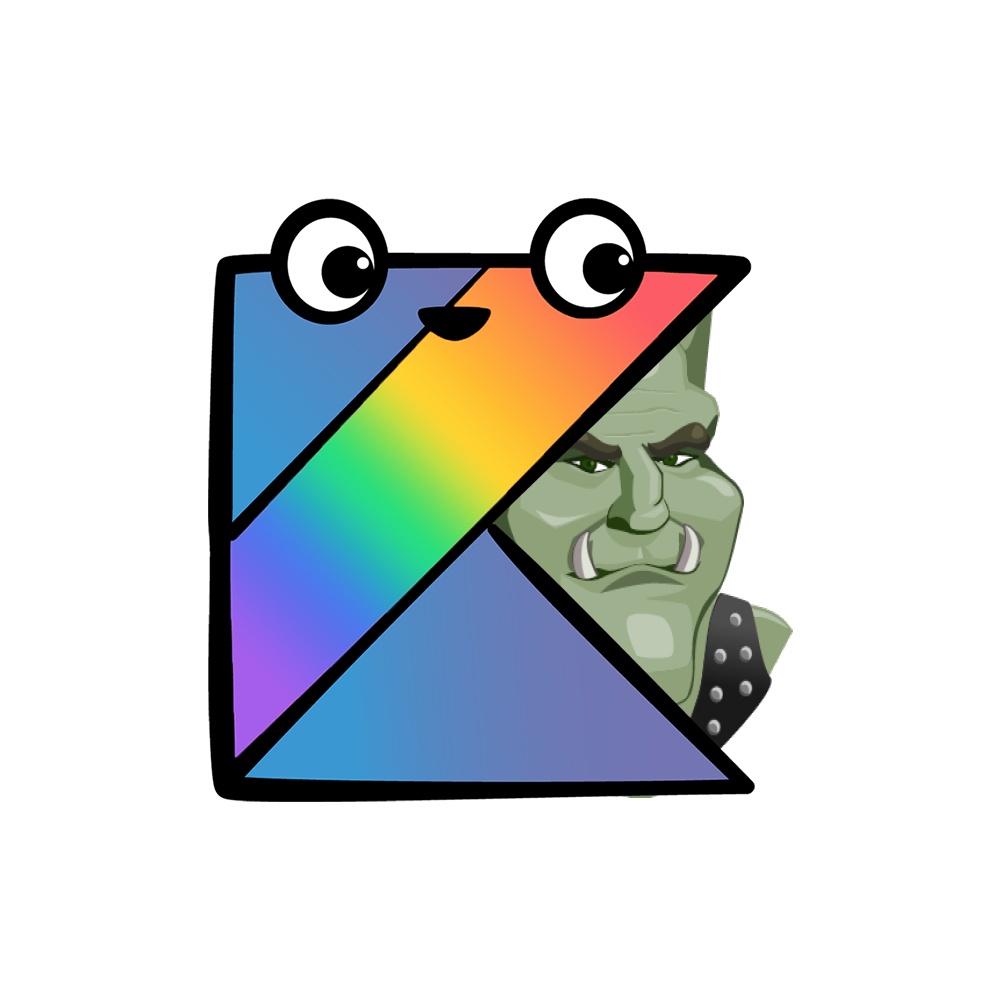

#  ORK: Object Relational Mapping for Kotlin

[](https://jitpack.io/#CoasterFreakDE/ORK)   [](https://discord.gg/PEqVSTwy2K)

ORK is a small project aiming to utilizing Kotlin dataclasses to use as ORM System

## Import in your Gradle/Maven Project

### 🐘 - Gradle:

#### Add Jitpack as Maven repo
```
repositories {
	maven { url 'https://jitpack.io' }
}
```

#### Add it to your dependencies
```
dependencies {
	compile 'com.github.CoasterFreakDE:ork:0.7-SNAPSHOT'
}
```

### Maven:

#### Add Jitpack as Maven repo
```
<repositories>
	<repository>
		<id>jitpack.io</id>
		<url>https://jitpack.io</url>
	</repository>
</repositories>
```

#### Add it to your dependencies
```
<dependency>
	<groupId>com.github.CoasterFreakDE</groupId>
	<artifactId>ork</artifactId>
	<version>0.7-SNAPSHOT</version>
</dependency>
```


### Features/Todos:

- [X] Connect to jdbc url
- [X] Create Tables from DataClass
- [X] Save (INSERT OR UPDATE) DataClasses directly to your database with `.save()`
- [X] Delete Data with `.delete()`
- [ ] Select Data from database
- [ ] References (Foreign Keys)
- [ ] Move the PrimaryKey Annotation directly to the field

---

### Connecting to your database

Connecting to your database is easy. Just add your credentials in a "connect" block at the start of your app.

To use sqlite just use `driver { "sqlite" }` and `host { "your.db" }`
```kotlin
	connect {
		host { "localhost" }
		port { 3306 }
		driver { "mariadb" } // Supported: mysql, mariadb, sqlite
		database { "database" }
		username { "root" }
		password { "1234" }
		autoReconnect { true }
	}
```

---
### Creating Tables

To  create a table there are two steps you need to follow.

#### Create a data class

A Tableclass consists of 3 different parts.
- Implementing the interface `ITable`
- At least **one** PrimaryKey
- FieldNames

```kotlin
	@PrimaryKey("name", "gamegroup")
	data class MyTable(

		@FieldName("name")
		val name: String = "Peter",

		@FieldName("gamegroup")
		val gamegroup: String = "Orks",

		@FieldName("xp")
		val xp: Int = 0,

	) : ITable
```

#### Create the Table

This is as simple as putting butter on bread.
You can add all your tables into a single statement by separating them with a `,`

```kotlin
	createTable(MyTable::class.java)
```

### Saving/Updating/Deleting data

Now here comes the fun part. As you will use these functions most of the time they need to be super simple.

```kotlin
	val myDataToSave = MyTable("Hulk")
	myDataToSave.save() // Insert or update data to the database
	myDataToSave.delete() // Delete data from the database
```

### Selecting / Searching for data


### Contributing

Feel free to leave a pull request or ticket for feature requests.

### Code Coverage

Try to cover as much as possible with tests.
Check [here](https://CoasterFreakDE.github.io/ORK/target/jacoco-ut/)
